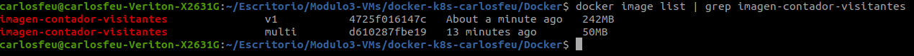
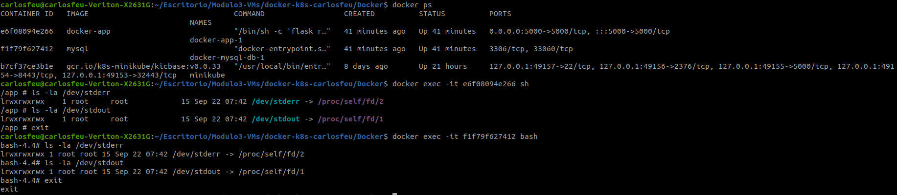

# Practica de Docker y Kubernetes 

- En este archivo README.md vamos a ver todo lo relacionado con la practica final del módulo.
- El repositorio se llama docker-k8s-carlosfeu
- Accederemos a el a través de gitclone https://github.com/KeepCodingCloudDevops6/docker-k8s-carlosfeu.git
- Se ha desplegado en un cluster con 3 nodos, en la version 1.23.8 de GKE, en una maquina con 2GB de RAM y de 0'5 a 2 CPU(e2.small). En la zona europe-west-b, esta información es para desplegar K8s y Helm Charts con esta configuración.

## Docker
- La aplicación es un archivo de configuración escrito en python la cual trabaja con una base de datos mysql que consiste en un sencillo contador de visitantes que conforme vayamos refrescando la página ira aumentando. Una vez que queramos refrescar el numero de visitantes deberemos acceder a una ruta diferente a la principal para resetear el contador y luego volver a la pantalla de de los visitantes.

    
- Para hacer funcionar la aplicación, tenemos que clonar el repositorio (arriba lo encontramos), accederemos a la carpeta /Docker a través de 
     ```bash
      cd Docker/
     ```
    
- Para ejecutarla, una vez hagamos los pasos anteriores tenemos que lanzar el comando para levantar el docker-compose.yaml con la configuración y esperar que se inicie tanto el contenedor de MYSQL como el de la aplicacion.

    ```bash
    docker compose up
    ```
- Espereamos unos minutos y una vez levantada accederemos a ella en la barra del navegador a través de:
    
    ```bash
    localhost:5000
    ```
- Cada vez que queramos resetear el contador accederemos en la barra de busqueda del navegador a:
    ```bash
    localhost:5000/inicializa-contador
    ```
- Luego volveremos a localhost:5000 para volver a la pantalla principal de los visitantes.

- El dockerfile contiene los paquetes necesarios para la creación correcta de la imagen de la aplicación, crearemos directorios e instalaremos a través del requirements las librerias para poder desplegar la aplicación. definiremos las variables de entorno de la base de datos y el puerto donde vamos a exponer la aplicación.

- Para crear una imagen multistage el primer paso es coger el Dockerfile con nuestra configuración inicial y hacer una imagen con ella. Una vez que compile y se cree nuestra imagen que ha sido llamada "imagen-contador-visitantes:v1" veremos que tiene un tamaño de 242MB.

    ```bash
    docker build -f Dockefile -t imagen-contador-visitantes:v1 .
    ```
- Para reducir su tamaño crearemos otra imagen pero esta vez multistage donde va a ocupar mucho menos que la original. Esta configuración la tenemos en otro Dockerfile, llamado "Dockerfile.1". Lanzamos el siguiente comando para crearla.

    ```bash
    docker build -f Dockerfile.1 -t imagen-contador-visitantes:multi .
    ```
- Una vez creada haremos el siguiente comando para ver ambas imagenes listadas y sus respectivos tamaños:

    ```bash
    docker image list | grep imagen-contador-visitantes
    ```
    
    
    
    

- Se puede comprobar la salido de los logs por la salida estandar STDERR_STDOUT en la siguiente imagen:


    

- El archivo docker compose es configurable, tenemos que tener en cuenta algunos parámetros para que la base de datos y la aplicación conecten, pero por lo demás si eso se machea se puede hacer configurable como cambiar usuarios, contraseñas, nombre de la base de datos, puerto, host, etc.

## Despliegue de APP en K8S
### Versión del GKE 1.23

- Para desplegar una aplicación es kubernetes tenemos que crear varior archivos de configuración. Tenemos que tener los archivos correspondientes a la aplicación y a la BBDD. Estos archivos son en extensión YAML que los vamos a encontrar dentro del directorio /K8s/app.

- Vamos a instalar Ingress Controller que nos hará falta más adelante. Para ello ejecutaremos este comando en nuestro terminal.

    ```bash
    kubectl apply -f https://raw.githubusercontent.com/kubernetes/ingress-nginx/controller-v1.3.1/deploy/static/provider/cloud/deploy.yaml
    ```
- También crearemos secrets que no es más que un archivo con claves encriptadas. Para generar un secret, podemos coger como referencia algun otro archivo. para encriptar la contraseña en base 64 debemos lanzar el siguiente comando '''echo -n 'contraseñaejemplo' | base64''' de esta forma la salida de este comando será la encriptación de 'contraseñaejemplo'. Los secrets en kubernetes no aceptan variables que no esten encriptadas.

- Lo primero de todo va a ser crear un Namespace.

    ```bash
    kubectl create -f namespace.yaml
    ```
- Accedemos a ese namespace con el siguiente comando:

    ```bash
    kubectl ns counter-app-db
    ```

- Vamos a empezar creando lor archivos correspondientes a la APP.
    
    ```bash
    kubectl create -f services-app.yaml
    ```

    ```bash
    kubectl create -f configmap-app.yaml
    ```

    ```bash
    kubectl create -f secrets-app.yaml
    ```
    
    ```bash
    kubectl create -f deployment-app.yaml
    ```

    ```bash
    kubectl create -f autoescaling-hpa-app.yaml
    ```

- Este último comando es el de autoescalar la aplicación, cuando la aplicación con una maquina virtual llegue al 70% de uso de CPU escalará a otra aplicación para desahogar esta primera, así hasta el número maximo de replicas que se le configure en este caso 10. Suele utilizarse en APPs donde hay mucho tráfico y demanda de los usuarios. En nuestro caso no va a escalar nunca pero podemos lanzar el siguiente comando para ver que está creado.

    ```bash
    kubectl get hpa
    ```

- En el archivo del deployment.yaml utilizaremos variables de entorno que irá a coger tanto al configmaps como al secret esos valores necesarios para el despliegue de la aplicación. De esta manera hacemos una APP configurable ya que no hará falta tocar el archivo del deployment, unicamente CM y Secrets.

- Los siguientes archivos a crear son los de la BBDD.

    ```bash
    kubectl create -f services-db.yaml
    ```

    ```bash
    kubectl create -f configmap-db.yaml
    ```

    ```bash
    kubectl create -f secrets-db.yaml
    ```

    ```bash
    kubectl create -f persistentvolumeclaim-db.yaml
    ```

    ```bash
    kubectl create -f deployment-db.yaml
    ```

- En el caso de la BBDD pasa exactamente lo mismo, el código no está "hardcoded", si no que está configurado a través de CM y secrets. La diferencia entre la APP y la BBDD es que en esta última hemos creado un persistentvolumeclaim y un persistentvolume para la persistencia de datos.

- Lo primero que vamos a hacer es dentro del namespace "counter-app-db" (En el que estamos) vamos a lanzar el siguiente comando para obtener la "IP EXTERNA" de nuestro ingress controller que previamente hemos tenido que instalar.

    ```bash
    kubectl get svc --namespace=ingress-nginx
    ```
- Una vez tengamos dicha "IP" la copiamos en el portapapeles. Ya que esa va a ser la "IP" que vamos a configurar en el archvivo ingress.yaml para poder acceder a través de una DNS. En el archivo ingress.yaml en el apartado de host pegamos dicha "IP" separada en vez de por puntos, lo vamos a hacer con guiones "-" y al final pondremos ".nip.io" quedaría algo así: "34-79-26-124.nip.io" (Esta es una IP de prueba, no es la que hay que poner). Una vez hecho guardamos el archivo ingress.yaml. Y lo ejecutamos con el siguiente comando. Para poder exponer nuestra aplicación.

    ```bash
    kubectl create -f ingress.yaml
    ```
- Esperaremos unos minutos para que la base de datos que es lo que más tarde en desplegarse pueda hacerlo sin problemas y no de error la aplicación.

- Cuando acabemos, lanzamos el siguiente comando para eliminar todos los archivos el deploy, ya que borrando el namespace nos cargamos todo lo que haya dentro.

    ```bash
    kubectl delete ns counter-app-db
    ```


## Helm Charts

- En este Chart de Helm vamos a encontar a parte de los archivos de configuración minimos y necesarios para desplegar una aplicación, encontraremos un ingress controller configurable, un archivo de autoescalado en función del consumo de CPU y tenemos configurado la persistencia de forma dinamica para la base de datos.

- Lo primero que vamos a hacer es dentro del namespace "default" vamos a lanzar el siguiente comando para obtener la "IP EXTERNA" de nuestro ingress controller que previamente hemos tenido que instalar. En caso de no haberlo instalado se hace a través del siguiente comando:

- Instalación de ingress controller

    ```bash
    kubectl apply -f https://raw.githubusercontent.com/kubernetes/ingress-nginx/controller-v1.3.1/deploy/static/provider/cloud/deploy.yaml
    ```
- Comando para saber la "IP EXTERNA" del ingress controller

    ```bash
    kubectl get svc --namespace=ingress-nginx
    ```
- Una vez tengamos dicha "IP" la copiamos en el portapapeles. Ya que esa va a ser la "IP" que vamos a configurar en el values.yaml para poder acceder a través de una DNS. En el archivo values.yaml en el apartado de host dentro de ingress pegamos dicha "IP" separada en vez de por puntos, lo vamos a hacer con guiones "-" y al final pondremos ".nip.io" quedaría algo así: "34-79-26-124.nip.io" (Esta es una IP de prueba, no es la que hay que poner). Una vez hecho guardamos el archivo values.yaml.

- Para poder desplegar la aplicación deberemos acceder a la carpeta llamada /docker-k8s-carlosfeu y desde ahí lanzar el siguiente comando, que sería para hacer la instalación del chart. se hace desde la carpeta /docker-k8s-carlosfeu ya que en esta se encuentra oto directorio llamado /counter-app que es donde encontramos los archivos con las estructura de carpetas necesaria para poder ejecutar los helm charts.

    ```bash
    helm install deploy counter-app/
    ```
- Una vez lanzado el comando vamos a esperar unos minutos que se instale y se levanten todos los servicios y lo haga también tanto el deploy como la base de datos que es lo que más va a tardar. En el values.yaml podremos ver que hemos hecho configurable todos los archivos de configuración. El servicio de la app es de tipo LoadBalancer. En el apartado deployment hemos configurado tanto la afinidad entre la base de datos y la aplicación y la anti-afinidad entre las replicas de la aplicación. poddemos cambiar los datos del archivo values.yaml ya que se camnian en todo el deployment si la base de datos queremos que se llame "pepito" y el username "juanito" podemos hacerlo sin problemas.

- La aplicación es un sencillo contador de visitantes que conforme vayamos refrescando la página ira aumentando. Una vez que queramos refrescar el numero de visitantes deberemos añadirle al DNS con el que hemos accedido. Pongo el ejemplo de antes: "34-79-26-124.nip.io/inicializa-contador" accediendo con dicha IP a "/inicializa-contador" veremos que nos aparece un mensaje en pantalla que dice: "Contador inicializado a 0" esto quiere decir que si volvemos a la dirección pero quitandole esto ultimo que le hemos añadido de "/inicializa-contador" volveremos a la pantalla de de los visitantes pero esta vez estará reseteado.

## Exposición de Métricas y de Logs


